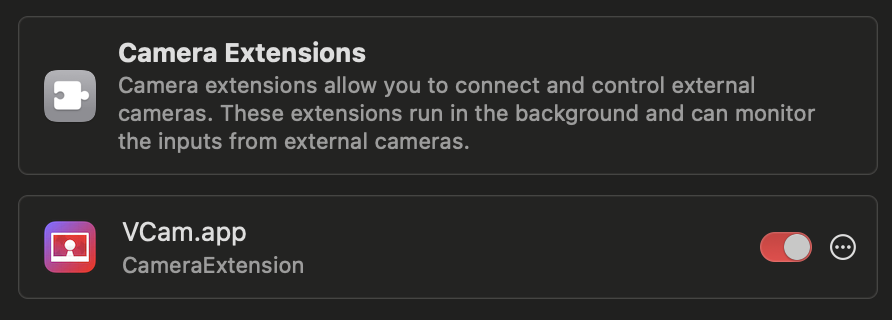

# Virtual Camera Settings

VCam has a camera function called a virtual camera.

By using this, you can get video conferencing apps such as Zoom and Google Meet to recognize VCam as a camera.

## Set up the Virtual Camera

In the "Virtual Camera" settings of VCam, you can check the status and install or uninstall the virtual camera.

After installation or uninstallation, you need to enable the CameraExtension in macOS's Settings under General > Login Items & Extensions > Camera Extensions' info icon > VCam.app.

<figure><figcaption></figcaption></figure>


For the current macOS, there may be times when you need to restart your Mac after installing or uninstalling plugins. If it's not working properly, please restart your Mac. And, VCam must be installed in the "Applications" folder.


macOS 14 or earlier

For macOS 14 or earlier, you need to click 'Allow' in the 'Privacy & Security' settings on your Mac to apply the changes.

## How to Use the Virtual Camera

In the camera list of the application that uses a camera, "VCam - CameraExtension \[Number]" will be displayed.

When you select "VCam - CameraExtension", the virtual camera displays the VCam's screen.

## Updating the Virtual Camera

When VCam is updated, you may need to update the virtual camera. In that case, click "Reinstall" in the "Virtual Camera" section of VCam's settings screen.

After reinstalling, restart the VCam app.

The current latest version is "`VCam - CameraExtension [3]`".

## Notes When Using VCam and VCam2D Together

If you uninstall either VCam or VCam2D after installing both, the virtual camera may not function properly. In such cases, please reinstall the VCam app you are using.

Old documentation (for VCam 0.10.1 and below)

Currently, there are two types of virtual cameras:

- Virtual Camera (DAL)
  - Installed upon the first launch.
- New Virtual Camera (CameraExtension)
  - Currently, only supporters can use this feature.

The new virtual camera reduces the load on the Mac.

Also, Apple has announced that "Virtual Camera (DAL)" will no longer be supported in macOS 14.

[Apple's Announcement](https://developer.apple.com/videos/play/wwdc2022/10022/)

### Virtual Camera (DAL) Setup

Follow the alert that appears upon the first launch to install.

If you want to reinstall due to a problem or otherwise, click "Initial Setup" in the "VCam" menu.

If you want to uninstall the virtual camera, click "Uninstall Plugin" in the "VCam" menu.

