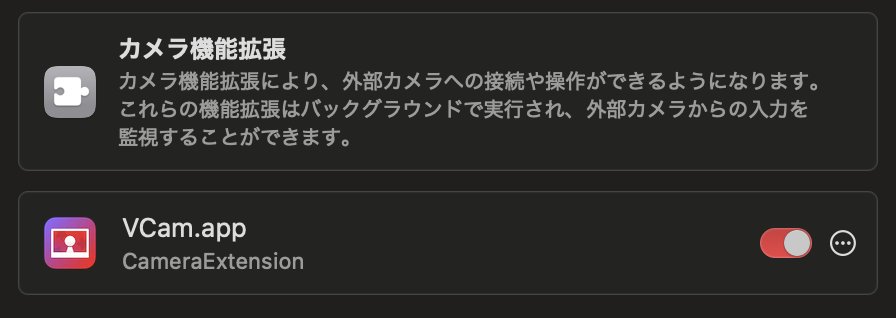

# OBSと連携する

<figure><figcaption></figcaption></figure>

## VCam OBS Pluginを使う (おすすめ)

この方法は他の方法に比べて負荷を軽減できます。


このプラグインを利用するためには、サポーター版のアプリで利用できる「実験的な機能」の中の「新しい仮想カメラを使用する」を有効にする必要があります。


### インストール

下記から最新版の .pkg ファイルをダウンロードし、ファイルを開いてインストールします。\
インストール後、OBS Studioは再起動してください。



### 使い方

1. OBS Studioのソースの「+ボタン」をクリックし、「VCam」を選択して、ソースに追加します。
2. VCamアプリを開き、設定メニュー (歯車) から「実験的な機能」を選択し、「新しい仮想カメラを使用する」を有効にします。

<figure><figcaption></figcaption></figure>

3. OBS StudioにVCamの映像が映ります。

### クロマキー無しで背景を透明にする

VCamの背景選択から背景色を選択します。

<figure><figcaption></figcaption></figure>

そして、不透明度を0%にすると、OBS上の背景が透明になります。

<figure><figcaption></figcaption></figure>

## 映像デバイスからとしてVCamを利用する

1. ソースの追加ボタンから「映像キャプチャデバイス」を選択し、新規作成します。

<figure><figcaption></figcaption></figure>

2. デバイスから「VCam - CameraExtension \[数字]」または「VCam」を選択します。

<figure><figcaption></figcaption></figure>

※この時に事前にVCamを開いていれば、プレビューが表示されます。選択後にVCamを起動した場合は、デバイスのリストから別のデバイスを選んだ後にVCamを選び直すことでプレビューできます。

3. ソースをCtrl+クリックし、メニューから「フィルタ」を選択します。

4. エフェクトフィルタの追加ボタンをクリックし、「クロマキー」を選択します。

5. VCam側の背景色に合わせて、色キーを設定すると背景色を消すことができます。

6. (ウィンドウサイズによって余白が出ている場合は) エフェクトフィルタに「クロップ/パッド」を追加することで黒帯などを消すことができます。

これで自由自在にアバターとゲームの映像などを合成できるようになりました。\
VCamはアプリを最小化していても多くの機能は動作をするため、操作ウィンドウが不要な方は最小化してみてください。
