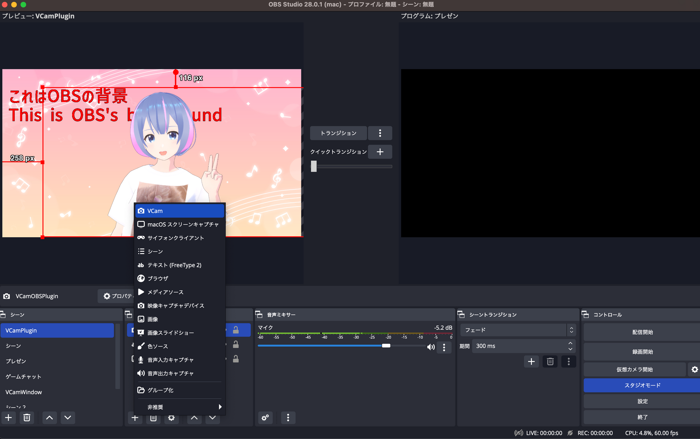

# 仮想カメラ設定

VCam には仮想カメラと呼ばれるカメラ機能があります。

これを利用することで、Zoom や Google Meet などのビデオ会議アプリなどでも、VCam をカメラとして認識させることができます。

## 仮想カメラの設定

VCam の設定画面の「仮想カメラ」で動作状況の確認や仮想カメラのインストールやアンインストールができます。

インストールやアンインストール後は Mac の設定の「一般」→「ログイン項目と拡張機能」→「カメラ機能拡張」の i マーク →VCam.app の CameraExtension を有効にする必要があります。

<figure><figcaption></figcaption></figure>


現在の macOS ではプラグインのインストールやアンインストール時に Mac の再起動が必要になる場合があります。正常に動作しない場合などは Mac を再起動してください。 また、VCam が「アプリケーション」フォルダにインストールされている必要があります。


macOS 14以前

macOS 14以前では、Macの設定の「プライバシーとセキュリティ」で「許可」をクリックし設定を反映させる必要があります。

## 仮想カメラの使い方

カメラを利用するアプリのカメラ一覧に「VCam - CameraExtension \[番号]」が表示されます。

「VCam - CameraExtension」を選ぶと、VCam の映像を表示できます。

## 仮想カメラの更新

VCam のバージョンアップに伴い、仮想カメラの更新が必要になる場合があります。その場合は、VCam の設定画面の「仮想カメラ」で「再インストール」をクリックしてください。

再インストール後は、VCam アプリを再起動してください。

現在の最新バージョンは「`VCam - CameraExtension [3]`」です。

## VCam と VCam2D 併用時の注意点

VCam と VCam2D の両方をインストール後、どちらかをアンインストールすると仮想カメラが正常に動作しなくなる場合があります。その場合は、利用しているどちらかの VCam アプリを再インストールしてください。

過去のドキュメント (VCam 0.10.1以下用)

仮想カメラには現在、2 種類あります。

- 仮想カメラ (DAL)
  - 初回起動時にインストールされます。
- 新しい仮想カメラ (CameraExtension)
  - 現在はサポーターのみが使える機能です。

新しい仮想カメラのほうが Mac の負荷が軽減されます。

また、「仮想カメラ (DAL)」は macOS 14 でサポート終了することが Apple により発表されています。

https://developer.apple.com/videos/play/wwdc2022/10022/

### 仮想カメラ (DAL)の設定

初回起動時に表示されるアラートに従ってインストールしてください。

不具合などで再インストールしたい場合は、「VCam」メニューの「初期設定」をクリックしてください。

仮想カメラをアンインストールしたい場合、「VCam」メニューの「プラグインのアンインストール」をクリックしてください。

